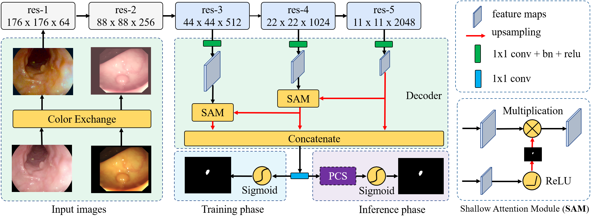
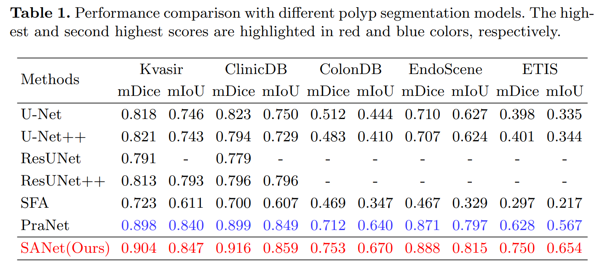
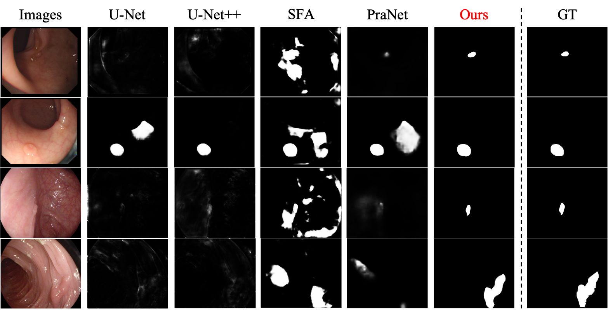

## [Shallow Attention Network for Polyp Segmentation](https://arxiv.org/pdf/2108.00882.pdf)
by Jun Wei, Yiwen Hu, Ruimao Zhang, Zhen Li, S.Kevin Zhou, Shuguang Cui

## Introduction
Accurate polyp segmentation is of great importance for colorectal cancer diagnosis. However, even with a powerful deep neural network, there still exists three big challenges that impede the development of polyp segmentation. (i) Samples collected under different conditions show inconsistent colors, causing the feature distribution gap and overfitting issue; (ii) Due to repeated feature downsampling, small polyps are easily degraded; (iii) Foreground and background pixels are imbalanced, leading to a biased training. To address the above issues, we propose the Shallow Attention Network (SANet) for polyp segmentation. Specifically, to eliminate the effects of color, we design the color exchange operation to decouple the image contents and colors, and force the model to focus more on the target shape and structure. Furthermore, to enhance the segmentation quality of small polyps, we propose the shallow attention module to filter out the background noise of shallow features. Thanks to the high resolution of shallow features, small polyps can be preserved correctly. In addition, to ease the severe pixel imbalance for small polyps, we propose a probability correction strategy (PCS) during the inference phase. Note that even though PCS is not involved in the training phase, it can still work well on a biased model and consistently improve the segmentation performance. Quantitative and qualitative experimental results on five challenging benchmarks confirm that our proposed SANet outperforms previous state-of-the-art methods by a large margin and achieves a speed about 72FPS.

## Clone repository

```shell
git clone https://github.com/weijun88/SANet.git
cd SANet/
```

## File tree
```
SANet                           
├─data                          
│  ├─test                       
│  │  ├─CVC-300                 
│  │  │  ├─image
│  │  │  └─mask
│  │  ├─CVC-ClinicDB
│  │  │  ├─image
│  │  │  └─mask
│  │  ├─CVC-ColonDB
│  │  │  ├─image
│  │  │  └─mask
│  │  ├─ETIS-LaribPolypDB
│  │  │  ├─image
│  │  │  └─mask
│  │  └─Kvasir
│  │      ├─image
│  │      └─mask
│  └─train
│      ├─image
│      └─mask
├─eval
│  └─prediction
│      └─SANet
│          ├─CVC-300
│          ├─CVC-ClinicDB
│          ├─CVC-ColonDB
│          ├─ETIS-LaribPolypDB
│          └─Kvasir
├─fig
├─res
└─src
    └─out
```

## Download dataset

The training and testing datasets come from [PraNet](https://github.com/DengPingFan/PraNet). Download these datasets and unzip them into `data` folder

- [Training Dataset](https://drive.google.com/file/d/1lODorfB33jbd-im-qrtUgWnZXxB94F55/view?usp=sharing)
- [Testing Dataset](https://drive.google.com/file/d/1o8OfBvYE6K-EpDyvzsmMPndnUMwb540R/view?usp=sharing)

## Download model

- If you want to test the performance of SANet, please download our trained model ([Baidu: km9q](https://pan.baidu.com/s/10FLaRoTsZq8ESmnS6I-TVQ) | [Google](https://drive.google.com/file/d/1x6zE73weJ6I_4Vquwe4bt0zf_gahNo0n/view?usp=sharing)) into `src/out` folder
- If you want to train your own model, please download the [pretrained model](https://drive.google.com/file/d/1_1N-cx1UpRQo7Ybsjno1PAg4KE1T9e5J/view?usp=sharing) into `res` folder

## Prerequisites

- [Python 3.7](https://www.python.org/)
- [Pytorch 1.8](http://pytorch.org/)
- [OpenCV 4.5](https://opencv.org/)
- [Numpy 1.18](https://numpy.org/)
- [Albumentations 0.5](https://github.com/albumentations-team/albumentations)
- [Apex](https://github.com/NVIDIA/apex)

### Using Docker Containers

Matching specific requirements (Python version, CUDA version, cuDNN version, etc.) may be challenging.
You can use containerization technology to make sure environment is consistent.

To do so, follow these steps:

1. Make sure that `docker`, and `nvidia-container-toolkit` are installed in your system.
2. [Create the custom](#creating-the-docker-image) image using the `DockerFile`.
3. [Create a container]() form the image. Make sure that GPU parameters and volume mapping are added to the container creation command.
4. Connect to the container and execute training or evaluation.

### Creating the Docker Image

Make sure you are in the root directory of the project, then execute the following command:

```shell
  docker build -f DockerFile -t sanet .
```

- `-f` attribute is to point to the location of `DockerFile`.
- `-t` attribute is to name the image.

### Creating the Container

Replace `<ABSOLUTE_PATH_TO_PROJECT_ROOT>` with the absolute path to project's root. Then execute the following code to create the container.

```shell
    docker run \
    -v <ABSOLUTE_PATH_TO_PROJECT_ROOT>:/workspace \
    --name sanet-dev \
    --pull missing \
    --ipc host \
    --gpus all \
    sanet:latest 
```

- `-v` is to map a directory from your machine to the container.
- `--name` is the name of the container.
- `--gpus all` will give GPU access to GPUs.

### Connecting to the Container

Execute the following command to connect to the created container.

```shell
  docker exec --workdir /workspace -it sanet-dev bash
```

## Training

```shell
    cd src/
    python3 train.py
```

## Testing

```shell
    cd src
    python3 test.py
```
- After testing, predictions of testing dataset will be saved in `eval/SANet/` folder.

## Evaluation
- To evaluate the performace of SANet, please use MATLAB to run `main.m`
```shell
    cd eval
    matlab
    main
```

## Predictions & Trained model
- trained model: [Baidu: km9q](https://pan.baidu.com/s/10FLaRoTsZq8ESmnS6I-TVQ) | [Google](https://drive.google.com/file/d/1x6zE73weJ6I_4Vquwe4bt0zf_gahNo0n/view?usp=sharing)
- predictions: [Baidu：598i](https://pan.baidu.com/s/1u6EdWxn9WHy0drEK3LBUwA) | [Google](https://drive.google.com/file/d/1hIJzzKA5aQEyLIRid5PJU9_JZZ4nGkGQ/view?usp=sharing)

- Quantitative comparisons 


- Qualitative comparisons 


## Citation
- If you find this work is helpful, please cite our paper
```
@inproceedings{SANet,
  title        = {Shallow Attention Network for Polyp Segmentation},
  author       = {Wei, Jun and Hu, Yiwen and Zhang, Ruimao and Li, Zhen and Zhou, S.Kevin and Cui, Shuguang},
  booktitle    = {International Conference on Medical Image Computing and Computer-Assisted Intervention},
  pages        = {699--708},
  year         = {2021},
  organization = {Springer}
}
```
